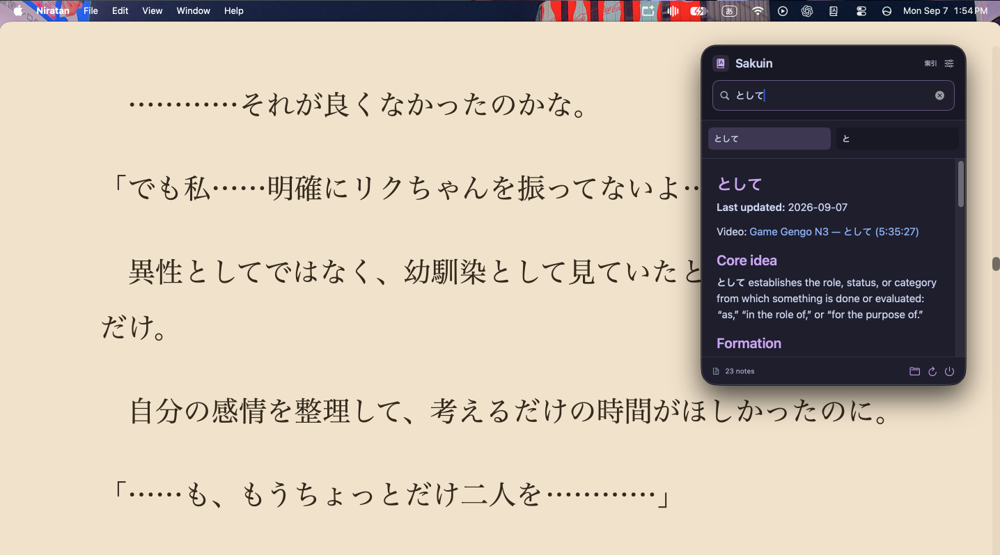

# Sakuin

A small macOS menu-bar app for searching and reading your own Japanese notes. Everything stays in a local folder; no account or database needed.



## Your notes

Put your UTF-8 Markdown (`.md`) files in a folder, using Japanese filenames such as `気味.md` or `ことがある.md`. Only filenames containing kana or kanji are indexed, so files like `README.md` and `N3.md` are skipped. Mixed titles such as `N3 気味.md` work. Filenames are the main search index; headings and note text are also searchable.

Subfolders can be organized however you like. No template or special headings are required. Hidden files and folders are skipped. Standard Markdown, tables, task lists, and relative links and images are supported. File links open in your default app. Obsidian plugins, wiki links, and embedded HTML are not supported.

## Run

Requires macOS 14+ and Swift 6 (Xcode 16+ or the corresponding Command Line Tools).

```sh
swift run Sakuin
```

Click the menu-bar icon, choose your notes folder, and search. Use ←/→ or ↑/↓ to move between results. The default global shortcut is Control–Option–G; change it in settings. Notes reload when you open the panel, or when you click Refresh. Markdown uses Catppuccin Latte in light mode and Mocha in dark mode.

To build an app you can move into Applications:

```sh
swift build -c release
Packaging/package-app.sh
```

The app is created at `dist/Sakuin.app` and is locally signed, not notarized. Run tests with `swift test`.

This is an early version. Improvements are coming.
